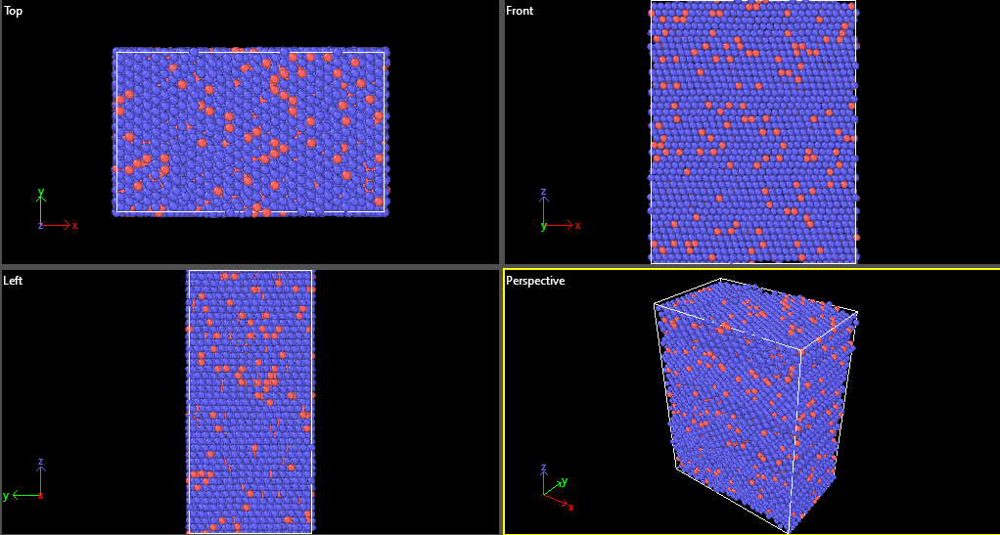

# 🧪 Al-10%Cu Molecular Dynamics Simulation

This project simulates the tensile deformation of an Al-10%Cu alloy using [LAMMPS](https://lammps.org) and visualises the results with [OVITO](https://ovito.org).

---

## 📁 Project Contents
18000 atoms
2 atom types

- `Al_10_Cu(1).bat` — ATOMSK input Alloy Creation script
- `Al_10_Cu(1).lmp` — LAMMPS input Energy minimisation (lattice Parameter) script
- `Al_10_Cu_Cast(1).lammps` — LAMMPS input script for Casting
- `Al10CuTensile(1).lmp` — LAMMPS input script for Tensile Test
- `Al_10_Cu_2.lmpdat` — Atomic structure file
- `Extract_data(1).bat` — Shell script to execute simulation (Windows)
- `results/` — Output plots, logs, screenshots

---

## 🧾 Goal

To understand the deformation behaviour and dislocation motion in an Al-10%Cu alloy at the atomic scale using molecular dynamics.

---

## 📸 Sample Results

---

## 🧠 Status

This is a beginner-level project done as part of my learning in molecular dynamics. I am eager to improve and open to feedback or collaboration.

---

## 📜 License

MIT License
