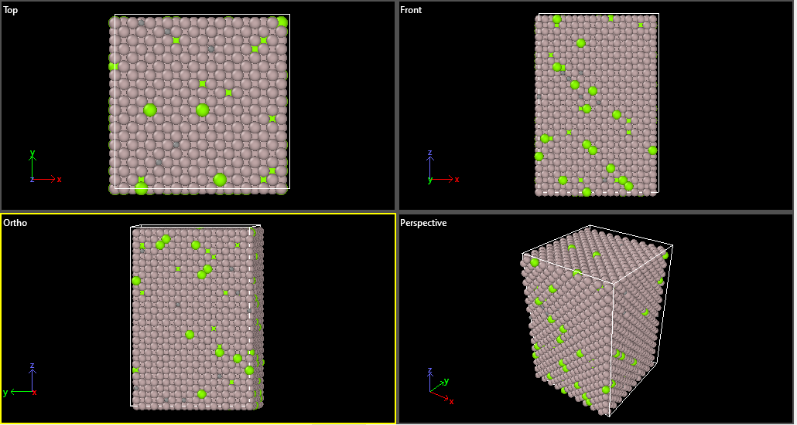

# AlMgC Atomic Structure Generator

This batch script uses Atomsk to create an aluminum-magnesium-carbon (AlMgC) alloy atomic structure file for molecular dynamics simulations.

## Description

The script performs the following operations:
1. Creates an FCC aluminum lattice with lattice parameter 4.046 Å
2. Duplicates the unit cell to create a 10×10×15 supercell
3. Randomly substitutes:
   - 3% of Al atoms with Mg
   - 2% of Al atoms with C
4. Outputs the structure in LAMMPS data format (renamed from .lmp to .lmpdat)

## Requirements

- [Atomsk](https://atomsk.univ-lille.fr/) installed and added to system PATH
- Windows operating system (for batch script execution)

## Output File

The generated `AlMgC(1).lmpdat` contains:
- Atomic coordinates in LAMMPS data format
- Mixed Al/Mg/C system with specified concentrations
- FCC crystal structure oriented along [100], [010], [001] directions
## Sample Results

## Customization

To modify the script:
- Change the lattice parameter by editing `4.046`
- Adjust supercell size by changing `10 10 15`
- Modify alloy concentrations by changing `3%%` and `2%%` values
- Change output filename by editing `AlMgC.lmp`

## Notes

- Percent signs are doubled (`%%`) in batch files to escape special characters
- The `pause` command keeps the window open to view any potential errors
