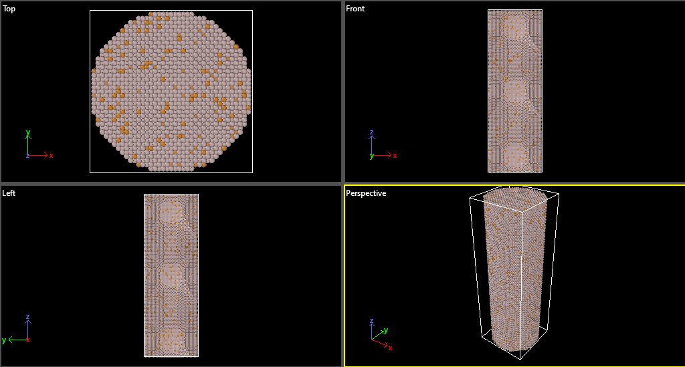

# Al-Cu Alloy Nanowire Generator
This batch script uses Atomsk to create an aluminium-copper (Al-Cu) alloy nanowire structure with cylindrical geometry for molecular dynamics simulations.

## Description
The script performs the following operations:
1. Creates an FCC aluminium lattice with lattice parameter 4.046 Å
2. Duplicates the unit cell to create a 20×20×60 supercell (creates an elongated structure)
3. **Cylindrical Nanowire Creation**:
   - Selects atoms outside a central cylinder along the Z-axis
   - Removes these outer atoms, leaving only a cylindrical nanowire
   - Cylinder parameters:
     - Center at (0.5*box, 0.5*box) in XY plane
     - Radius of 40 Å
     - Full length of the Z-axis (60 unit cells)
4. Randomly substitutes 10% of remaining Al atoms with Cu
5. Outputs the structure in LAMMPS data format (renamed from .lmp to .lmpdat)

## Requirements
- [Atomsk](https://atomsk.univ-lille.fr/) installed and added to system PATH
- Windows operating system (for batch script execution)

## Cylindrical Geometry Details
The cylindrical selection is created with:
```atomsk
-select out cylinder Z 0.5*box 0.5*box 40

Where:
  -Z specifies the cylinder axis orientation
  -0.5*box 0.5*box centres the cylinder in the XY plane (half the box dimensions)
  -40 sets the cylinder radius in Angstroms (40Å)
The removal of outer atoms creates:
  -A pristine cylindrical nanowire structure
  -Free surfaces on the sides (cylindrical surface)
  -Periodic boundary conditions maintained along Z-axis (wire axis)

##Output File
The generated Al_10Cu_alloy.lmpdat contains:
  -Atomic coordinates in LAMMPS data format
  -Al-Cu alloy nanowire with 10% Cu concentration
  -FCC crystal structure oriented along [100], [010], [001] directions
  -Cylindrical free surfaces with diameter ~80Å
  -Periodic boundaries along Z-axis (wire length)
## Sample Results


## Customization
To modify the nanowire properties:
  -Change wire radius by modifying 40 in cylinder selection
  -Adjust length by changing the Z-duplication value (60)
  -Change alloy concentration by modifying 10%% Cu substitution
  -Alter output filename by editing Al_10Cu_alloy.lmp

## Suggested Applications
This structure is particularly useful for:
  -Nanowire mechanical property simulations
  -Surface diffusion studies
  -Electro-migration research
  -Nanoscale alloy phase formation
